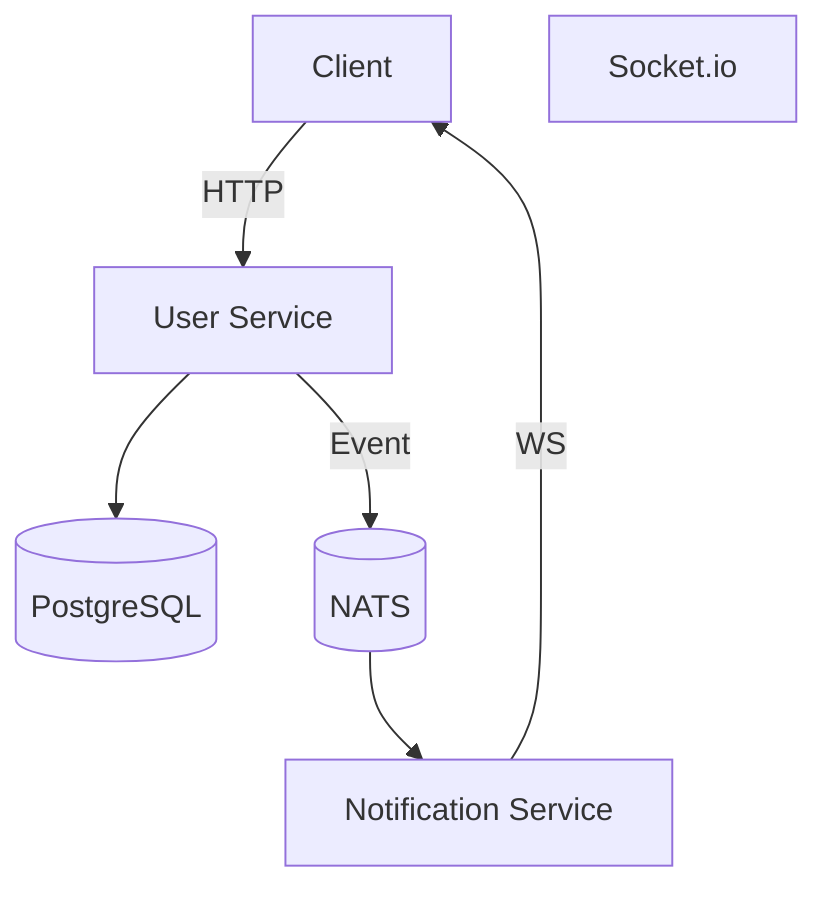

# REST API на NestJS 🚀

## 🔧 Стек технологий

- **NestJS** — фреймворк для создания серверных приложений
- **Nats** — легковесный, высокопроизводительный message broker
- **Redis** — key/v база данных для хранения кэша + использутся для очереди задач *bull*
- **PostgreSQL** — СУБД для хранения данных, запускается через Docker Compose
- **JWT** — для аутентификации и авторизации пользователей
- **Minio** — s3 хранилище используемое для хранения изображений
- **Docker Compose** — для развертывания окружения
- **Socket.io** — библеотека реализующая реалтайм соединение

## 🧱 Архитектура проекта



📌 **Описание компонентов:**

- **Client** — отправляет HTTP-запросы в `User Service` и слушает `Socket.IO` события.
- **User Service** — основная бизнес-логика, работает с PostgreSQL и публикует события через NATS.
- **Notification Service** — подписан на события из NATS и отправляет push-уведомления через WebSocket.
- **NATS** — брокер сообщений между сервисами.
- **Socket.IO** — используется `Notification Service` для real-time сообщений пользователям.
- **PostgreSQL** — хранит данные пользователей и транзакций.

📌 **Описание компонентов:**

- **Client** — отправляет HTTP-запросы в `User Service` и слушает `Socket.IO` события.
- **User Service** — основная бизнес-логика, работает с PostgreSQL и публикует события через NATS.
- **Notification Service** — подписан на события из NATS и отправляет push-уведомления через WebSocket.
- **NATS** — брокер сообщений между сервисами.
- **Socket.IO** — используется `Notification Service` для real-time сообщений пользователям.
- **PostgreSQL** — хранит данные пользователей и транзакций.

## 🚀 Как запустить проект

1. **Клонируйте репозиторий:**

   ```bash
   git clone https://github.com/karpovIlya/HARD-nestjs-test-task
   cd HARD-nestjs-test-task
   ```
2. **Создайте файл `.env` в корне проекта с содержимым:**

   ```
   PORT=3000
   NOTIFY_PORT=8080

   POSTGRES_HOST=127.0.0.1
   POSTGRES_PORT=5434
   POSTGRES_USER=postgres
   POSTGRES_PASSWORD=1477
   POSTGRES_DB=test-task

   REDIS_HOST=127.0.0.1
   REDIS_PASSWORD=1477
   REDIS_PORT=6379

   MINIO_HOST=127.0.0.1
   MINIO_PORT=9000
   MINIO_ACCESS_KEY=GiND0Raxrsntu6glFrJl
   MINIO_SECRET_KEY=zGuBmNBvk5QaiLeaFExJjeVKRz7YeTTz8T4whsi4

   JWT_ACCESS_SECRET=ACCESS_SECRET
   JWT_REFRESH_SECRET=REFRESH_SECRET
   JWT_ACCESS_EXPIRES_IN=15m

   NATS_SERVERS=nats://nats:4222
   NATS_NOTIFICATION_QUEUE=notification-service-queue
   NATS_USERNAME=root
   NATS_PASSWORD=wsbe
   NATS_PORT=4222
   NATS_HOST=127.0.0.1


   ```
3. **Запустите проект с помощью Docker Compose:**

   ```bash
   docker-compose up --build
   nest start user-service
   nest start notification-service
   ```
4. **API будет доступно на порту `3000`:**

   Теперь вы можете обращаться к API через [http://localhost:3000/api]()
5. **Socket.io соединение будет досутпно на порту 8080:**

   Теперь вы можете подключиться к сокету через [http://localhost:8080/notification](). Также необходимо добавить **authorization** с актуальным **accessToken,** иначе подключиться не удастся
6. **Swagger документация:**

   Swagger доступен по следующему адресу: [http://localhost:3000/api]()
